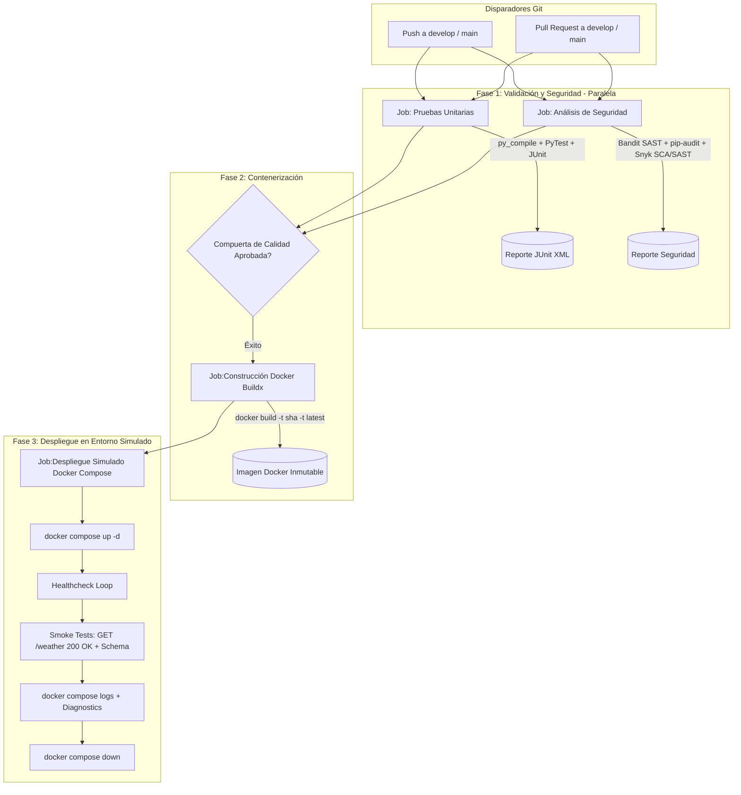

# Microservicio de Predicción Climática

Microservicio REST desarrollado con Python y FastAPI. Expone un endpoint de consulta meteorológica y cuenta con una arquitectura de integración continua (CI/CD) automatizada mediante GitHub Actions, diseñada conforme a estándares de ingeniería DevOps y buenas prácticas de desarrollo colaborativo.

---

## Índice

1. [Requisitos e Instalación Local](#requisitos-e-instalación-local)
2. [Contenerización con Docker](#contenerización-con-docker)
3. [Ejecución de Pruebas Automatizadas](#ejecución-de-pruebas-automatizadas)
4. [Especificación del Endpoint](#especificación-del-endpoint)
5. [Estrategias y Modelos de Ramificación (Branching Strategies)](#estrategias-y-modelos-de-ramificación-branching-strategies)
   - [Análisis de Modelos: GitFlow, GitHub Flow y Trunk-Based](#análisis-de-modelos-gitflow-github-flow-y-trunk-based)
   - [Tabla Comparativa de Modelos](#tabla-comparativa-de-modelos)
   - [Justificación Técnica del Modelo Seleccionado](#justificación-técnica-del-modelo-seleccionado)
6. [Guía de Buenas Prácticas para el Uso de Repositorios DevOps](#guía-de-buenas-prácticas-para-el-uso-de-repositorios-devops)
   - [1. Naming de Ramas y Flujos de Merge](#1-naming-de-ramas-y-flujos-de-merge)
   - [2. Convenciones de Mensajes de Commit](#2-convenciones-de-mensajes-de-commit)
   - [3. Estructura del Proyecto y Organización de Carpetas](#3-estructura-del-proyecto-y-organización-de-carpetas)
   - [4. Control de Versiones: SemVer, Git Tags y GitHub Releases](#4-control-de-versiones-semver-git-tags-y-github-releases)
7. [Integración y Entrega Continua (CI/CD) en GitHub Actions](#integración-y-entrega-continua-cicd-en-github-actions)
   - [Cumplimiento de Indicadores de Evaluación ](#cumplimiento-de-indicadores-de-evaluación)
   - [Arquitectura y Diagrama de Flujo del Pipeline](#arquitectura-y-diagrama-de-flujo-del-pipeline)
   - [Detalle de los Jobs Automatizados](#detalle-de-los-jobs-automatizados)
   - [Seguridad Continua: Dependabot y Snyk / SonarQube ](#seguridad-continua-dependabot-y-snyk--sonarqube)
   - [Despliegue en Entorno Simulado con Docker Compose](#despliegue-en-entorno-simulado-con-docker-compose)
8. [Trazabilidad del Flujo Colaborativo Simulado](#trazabilidad-del-flujo-colaborativo-simulado)

---

## Requisitos e Instalación Local

### Requisitos Previos

- Python 3.11 o superior.
- Gestor de paquetes `pip`.
- Git instalado y configurado en el sistema.

### Instalación de Dependencias

Se recomienda la creación de un entorno virtual:

```bash
# Crear entorno virtual
python -m venv .venv

# Activar entorno virtual
# En Windows (PowerShell):
.venv\Scripts\Activate.ps1
# En Linux / macOS:
source .venv/bin/activate

# Instalar dependencias de producción y desarrollo
pip install -r requirements.txt
pip install -r requirements-dev.txt
```

### Ejecución del Servidor

```bash
uvicorn main:app --reload --host 127.0.0.1 --port 8000
```

El servicio estará disponible en `http://127.0.0.1:8000` y la documentación interactiva Swagger UI en `http://127.0.0.1:8000/docs`.

---

## Ejecución de Pruebas Automatizadas

El proyecto incluye una suite de pruebas unitarias y de integración implementadas con `pytest` y `TestClient`:

```bash
pytest test_main.py -v
```

Estas pruebas verifican:
- Código de estado HTTP 200 en consultas válidas.
- Integridad y tipado de los campos devueltos en el esquema JSON (`location`, `temperature`, `status`, `wind_speed_kmh`).
- Comportamiento y cabeceras de seguridad del middleware CORS.

---

## Especificación del Endpoint

### `GET /weather`

Consulta el pronóstico climático actual de la estación meteorológica configurada.

#### Respuesta Exitosa (`HTTP 200 OK`)

```json
{
  "location": "Valparaíso",
  "temperature": 18,
  "status": "Soleado",
  "wind_speed_kmh": 12
}
```

---

## Estrategias y Modelos de Ramificación (Branching Strategies)

### Análisis de Modelos: GitFlow, GitHub Flow y Trunk-Based

En el desarrollo de software moderno y la adopción de prácticas DevOps, la estrategia de ramificación define las reglas para aislar, integrar y desplegar código de forma colaborativa, minimizando conflictos y maximizando la estabilidad del software.

#### 1. GitFlow
Propuesto por Vincent Driessen, es un modelo robusto y estructurado basado en ramas de larga duración (`main` y `develop`) y ramas transitorias especializadas (`feature/*`, `release/*`, `hotfix/*`).
- **`main`**: Almacena el historial oficial de lanzamientos en producción. Cada commit en esta rama corresponde a una versión estable y etiquetada (tag).
- **`develop`**: Rama de integración continua donde convergen las funcionalidades terminadas antes de preparar un release.
- **`feature/*`**: Ramas aisladas creadas desde `develop` para desarrollar nuevas capacidades, integradas mediante Pull Requests tras revisión.
- **`hotfix/*`**: Ramas de emergencia originadas directamente desde `main` para resolver fallos críticos en producción sin interrumpir el trabajo en curso en `develop`.

#### 2. GitHub Flow
Es un flujo de trabajo simplificado, centrado en entrega continua y ciclos rápidos de despliegue:
- Posee una única rama principal (`main` o `master`), la cual **siempre** debe estar en un estado desplegable a producción.
- Para cualquier cambio, se crea una rama descriptiva directamente desde `main`.
- La integración se realiza mediante Pull Request, donde se ejecutan pruebas automáticas y revisión por pares.
- Una vez aprobado el PR, el código se despliega a producción antes o inmediatamente después de hacer el merge en `main`.

#### 3. Trunk-Based Development (TBD)
Es la estrategia predilecta en organizaciones con alta madurez DevOps (ej. Google, Meta):
- Todos los desarrolladores realizan commits frecuentemente en una única rama troncal (`trunk` o `main`), ya sea directamente o a través de ramas efímeras de muy corta vida (menos de 24 a 48 horas).
- Depende de una infraestructura de CI extraordinariamente rápida y confiable que valide cada cambio en minutos.
- Utiliza **Feature Flags** (Feature Toggles) para desacoplar el despliegue del código del lanzamiento de la funcionalidad a los usuarios finales.

---

### Tabla Comparativa de Modelos

| Criterio | GitFlow | GitHub Flow | Trunk-Based Development |
| :--- | :--- | :--- | :--- |
| **Complejidad de Ramas** | Alta (múltiples ramas de larga duración y soporte) | Baja (una rama principal + ramas breves) | Mínima (una única rama troncal `main`/`trunk`) |
| **Ramas Principales** | `main` (producción) y `develop` (integración) | Solo `main` | Solo `main` / `trunk` |
| **Frecuencia de Despliegue** | Programada / por versiones (Releases periódicos) | Continua (múltiples despliegues diarios a producción) | Altísima frecuencia (integraciones múltiples al día) |
| **Manejo de Errores Críticos** | Ramas dedicadas `hotfix/*` desde `main` | Rama temporal desde `main` con despliegue inmediato | Fix directo en el troncal o desactivación con Feature Flag |
| **Madurez de CI/CD Requerida** | Media (automatización de compilación y pruebas por rama) | Alta (pruebas y despliegue continuo automáticos) | Muy Alta (tests e2e ultrarrápidos, telemetría y flags) |
| **Mantenimiento de Versiones** | Excelente (facilita mantener versiones legacy concurrentes) | Bajo (solo la última versión en producción existe) | Bajo (el troncal siempre avanza hacia adelante) |
| **Riesgo de "Merge Hell"** | Moderado a Alto si las ramas de soporte duran demasiado | Bajo | Casi nulo (integraciones pequeñas y frecuentes) |

---

### Justificación Técnica del Modelo Seleccionado

Para este microservicio se ha implementado y justificado la adopción de **GitFlow**, fundamentada en los siguientes factores técnicos y organizacionales:

1. **Aislamiento Seguro entre Desarrollo y Producción:**  
   Al tratarse de una arquitectura orientada a microservicios que alimenta servicios dependientes, la separación estricta entre la rama de integración (`develop`) y la rama de producción (`main`) garantiza que ningún cambio experimental o en desarrollo impacte la disponibilidad del entorno productivo.
2. **Control y Auditoría de Cambios mediante Quality Gates:**  
   GitFlow exige que cada nueva característica sea aislada en una rama `feature/*` y evaluada mediante Pull Requests antes de incorporarse a `develop`. Esto facilita la revisión de pares, la trazabilidad del código y la ejecución del pipeline CI previo al merge.
3. **Flujo Estandarizado de Respuesta ante Incidentes (`hotfix/*`):**  
   Permite corregir incidencias críticas en producción de forma inmediata mediante ramas `hotfix/*` derivadas de `main`, aplicando el parche directamente a producción y luego retroalimentando la rama `develop`, sin verse obligado a publicar características incompletas que aún residan en el flujo de desarrollo.
4. **Por qué no GitHub Flow:**  
   GitHub Flow asume un entorno de despliegue continuo a producción tras cada merge en `main`. Al no contar con un pipeline CD totalmente automatizado con aprovisionamiento cloud en tiempo real, omitir una rama de integración (`develop`) incrementaría exponencialmente el riesgo de inestabilidad en la rama principal.
5. **Por qué no Trunk-Based Development:**  
   Trunk-Based requiere una arquitectura de Feature Flags madura y un suite exhaustivo de pruebas end-to-end con monitoreo sintético avanzado. Para la fase de madurez actual del equipo y del microservicio, GitFlow proporciona las salvaguardas estructurales necesarias para evitar regresiones.

---

## Guía de Buenas Prácticas para el Uso de Repositorios DevOps

Esta guía establece el estándar operativo para equipos de desarrollo en entornos DevOps ágiles y colaborativos, cubriendo los 4 pilares fundamentales exigidos para la gestión de repositorios:

### 1. Naming de Ramas y Flujos de Merge

La nomenclatura de ramas debe ser semántica, autodescriptiva y en minúsculas, utilizando guiones para separar palabras (`kebab-case`).

- **Funcionalidades (`feature/<nombre>`):**  
  Nuevas capacidades del microservicio. Nacen desde `develop` y se integran exclusivamente a `develop`.  
  *Ejemplo:* `feature/weather-endpoint`, `feature/authentication-jwt`.
- **Correcciones críticas (`hotfix/<nombre>`):**  
  Reparación de bugs críticos detectados en producción. Nacen desde `main`, se integran a `main` y posteriormente se sincronizan hacia `develop`.  
  *Ejemplo:* `hotfix/cors-error`, `hotfix/null-pointer-exception`.
- **Preparación de lanzamientos (`release/<versión>`):**  
  Estabilización de una versión próxima a publicarse. Nacen desde `develop` y se integran tanto a `main` como a `develop`.  
  *Ejemplo:* `release/v1.0.0`.

#### Políticas de Protección de Ramas
- **Prohibición de push directo:** Tanto `main` como `develop` están protegidas; todos los cambios deben ingresar a través de Pull Requests.
- **Revisión obligatoria:** Al menos un desarrollador del equipo debe aprobar el Pull Request antes de su fusión.
- **Comprobaciones de estado obligatorias (Status Checks):** El pipeline CI (`ci.yml`) debe finalizar exitosamente antes de habilitar el botón de merge.
- **Eliminación post-merge:** Toda rama de soporte (`feature/*`, `hotfix/*`) debe eliminarse del repositorio remoto una vez que su PR haya sido integrado para evitar ramas huérfanas.

---

### 2. Convenciones de Mensajes de Commit

El equipo adopta el estándar internacional **Conventional Commits (v1.0.0)** para garantizar un historial limpio, legible y automatizable.

#### Formato Estándar
```text
<tipo>(<alcance opcional>): <descripción concisa en modo imperativo y minúsculas>

[cuerpo explicativo opcional del cambio y su motivación]

[referencias a issues, pull requests o breaking changes opcionales]
```

#### Tipos Permitidos
- `feat:` Incorporación de una nueva funcionalidad.
- `fix:` Corrección de un defecto o error de software.
- `docs:` Modificaciones exclusivas en la documentación (README, especificaciones).
- `test:` Inclusión o corrección de pruebas unitarias o de integración.
- `ci:` Cambios en pipelines de automatización o workflows (GitHub Actions).
- `refactor:` Reestructuración de código que no añade funcionalidades ni corrige bugs.
- `chore:` Tareas rutinarias de mantenimiento, dependencias o tooling.

#### Ejemplos Aplicados
```text
feat(api): añade endpoint GET /weather para entrega de métricas climáticas
fix(cors): añade middleware CORSMiddleware para habilitar solicitudes de origen cruzado
ci(actions): implementa ejecución de pytest y empaquetado de artefactos en workflow
docs(readme): documenta modelos de ramificación, control de versiones y rol de CI/CD
```

---

### 3. Estructura del Proyecto y Organización de Carpetas

La arquitectura del repositorio sigue una separación limpia de responsabilidades (Clean Directory Layout), separando código de aplicación, pruebas, pipelines, contenerización y metadatos de configuración:

```text
microservicio-clima/
├── .github/
│   ├── dependabot.yml           # Configuración de escaneo de dependencias automatizado 
│   └── workflows/
│       └── ci.yml               # Pipeline CI/CD: Tests, Seguridad, Docker y Despliegue 
├── .dockerignore                # Exclusiones del contexto Docker para builds rápidos y seguros
├── .gitignore                   # Exclusión de binarios, cachés y entornos virtuales locales
├── docker-compose.yml           # Orquestación de entorno simulado de despliegue con Healthchecks 
├── Dockerfile                   # Contenerización segura no-root basada en Python 3.11-slim 
├── main.py                      # Punto de entrada del microservicio FastAPI y endpoint /weather
├── test_main.py                 # Suite de pruebas unitarias automatizadas con pytest 
├── requirements.txt             # Dependencias de producción estrictamente versionadas
├── requirements-dev.txt         # Dependencias de desarrollo, linting y pruebas (pytest, bandit)
├── README.md                    # Documentación técnica integral del proyecto DevOps
└── EP1_DOY0101_Estudiante.pdf   # Pauta y especificación de evaluación académica
```

#### Buenas Prácticas de Higiene del Repositorio
- Ningún binario, paquete descargado (`site-packages`, `.venv`) o caché de intérprete (`__pycache__`, `*.pyc`) debe subirse al control de versiones. Esto se garantiza mediante el archivo `.gitignore`.
- Los archivos de configuración de dependencias (`requirements.txt`) deben ser explícitos para permitir construcciones deterministas en cualquier entorno.

---

### 4. Control de Versiones: SemVer, Git Tags y GitHub Releases

El control de versiones es el cuarto elemento indispensable de la gestión de repositorios en DevOps. Garantiza trazabilidad histórica, reproducibilidad de despliegues y comunicación clara de cambios a clientes y operadores del sistema.

#### Estándar Semantic Versioning (SemVer 2.0.0)
El versionado del proyecto sigue la convención `vMAJOR.MINOR.PATCH`:

- **MAJOR (v1.0.0):** Cambios que rompen compatibilidad con versiones anteriores (Breaking Changes), como modificaciones estructurales en los esquemas de respuesta del endpoint o eliminación de rutas.
- **MINOR (v1.1.0):** Incorporación de nuevas funcionalidades que mantienen compatibilidad hacia atrás (ej. nuevos parámetros de consulta o filtros en `/weather`).
- **PATCH (v1.0.1):** Corrección de errores y vulnerabilidades que conservan compatibilidad total (ej. resolución del bloqueo de CORS o parches de seguridad).

#### Estrategia de Etiquetado con Git Tags
Las etiquetas de Git permiten marcar puntos específicos e inmutables en el historial de commits. Se utilizan **tags anotados** (`annotated tags`), los cuales registran el autor, la fecha y un mensaje descriptivo criptográficamente firmado o validado:

```bash
# Crear un tag anotado sobre el commit actual en la rama main
git tag -a v1.0.0 -m "Release v1.0.0: Versión inicial estable con endpoint /weather, middleware CORS y pipeline CI completo"

# Listar las etiquetas existentes
git tag -n

# Publicar el tag específico en el repositorio remoto GitHub
git push origin v1.0.0

# Publicar todos los tags locales pendientes
git push origin --tags
```

#### Gestión de GitHub Releases
Un **GitHub Release** formaliza el paquete de entrega a partir de un Git Tag, publicando notas de lanzamiento (Changelog) y asociando los binarios o artefactos generados por el pipeline:

1. **Creación en GitHub:** Navegar a la pestaña *Releases* -> *Draft a new release*.
2. **Selección de Tag:** Vincular la etiqueta publicada (ej. `v1.0.0`) apuntando a la rama `main`.
3. **Título del Release:** Especificar un nombre claro (ej. `v1.0.0 - Initial Production Release`).
4. **Release Notes (Changelog):**
   - Resumen ejecutivo de la versión.
   - Lista detallada de nuevas características (`Features`).
   - Correcciones de errores (`Bug Fixes`).
   - Hash del commit correspondiente y enlaces a los Pull Requests integrados.
5. **Artefactos Adjuntos:** Vinculación del paquete de compilación (`microservicio-clima-artifact.zip`) generado por el workflow de GitHub Actions.

---

## Contenerización con Docker

El microservicio se encuentra completamente contenerizado mediante una imagen inmutable definida en el [`Dockerfile`](file:///Dockerfile), siguiendo las mejores prácticas de la industria en seguridad, rendimiento y reproducibilidad:

### Características de la Contenerización:
1. **Imagen Base Optimizada (`python:3.11-slim`):** Reduce drásticamente la superficie de vulnerabilidades y el peso de la imagen frente a imágenes genéricas.
2. **Usuario sin Privilegios (`appuser`):** La aplicación se ejecuta bajo un usuario no-root (`appuser`), garantizando el principio de mínimo privilegio (Least Privilege) y evitando posibles escaladas de privilegios en el host.
3. **Caché de Capas (Layer Caching):** Se copia e instala `requirements.txt` previo al código de negocio, acelerando los tiempos de compilación cuando no cambian las dependencias.
4. **Healthcheck Nativo:** Se incluye una comprobación de salud periódica mediante `python -c "import urllib.request..."` que evalúa la disponibilidad del endpoint `/weather`.

### Comandos de Construcción y Ejecución Local con Docker:

```bash
# Construir la imagen Docker localmente
docker build -t microservicio-clima:latest .

# Ejecutar el contenedor mapeando el puerto 8000
docker run -d --name clima-service -p 8000:8000 microservicio-clima:latest

# Comprobar estado y healthcheck del contenedor
docker ps

# Probar el microservicio en ejecución
curl http://localhost:8000/weather

# Ver logs del contenedor
docker logs clima-service

# Detener y eliminar el contenedor
docker stop clima-service && docker rm clima-service
```

---

## Integración y Entrega Continua (CI/CD) en GitHub Actions

El repositorio cuenta con una arquitectura de tubería CI/CD avanzada, orquestada de forma modular a través de GitHub Actions en el archivo [`.github/workflows/ci.yml`](file:///.github/workflows/ci.yml).

### Arquitectura y Diagrama de Flujo del Pipeline

El pipeline implementa paralelismo en las primeras etapas (Shift-Left) y compuertas estrictas de calidad (Quality Gates) antes de la construcción y el despliegue:



---

### Detalle de los Jobs Automatizados

#### 1. Job `pruebas_unitarias` 
- **Entorno:** `ubuntu-latest` con Python 3.11.
- **Compilación de Sintaxis:** Ejecuta `python -m py_compile main.py test_main.py` para prevenir errores de indentación o sintaxis.
- **Ejecución de Pruebas:** Corre `pytest test_main.py -v --tb=short --junitxml=reports/junit-test-results.xml`, certificando el contrato HTTP, tipado de datos y cabeceras CORS.
- **Artefactos:** Publica los reportes XML mediante `actions/upload-artifact@v4`.

#### 2. Job `analisis_seguridad` 
- **Bandit (SAST):** Análisis estático de seguridad sobre el código de la aplicación buscando vulnerabilidades comunes.
- **pip-audit (SCA):** Auditoría inmediata de paquetes buscando CVEs registrados en la base de datos de PyPI.
- **Snyk Open Source (SCA) & Snyk Code (SAST):**
  - Identifica dependencias vulnerables y sugiere parches automáticos.
  - Analiza estáticamente el código fuente en busca de brechas de seguridad (XSS, inyecciones, fallos de configuración).
  - *Configuración de Token:* Si se desea sincronizar con el panel en la nube de Snyk, agregue el secreto `SNYK_TOKEN` en `Settings -> Secrets and variables -> Actions` de su repositorio GitHub.

#### 3. Job `construccion_docker` 
- Requiere la aprobación previa de `pruebas_unitarias` y `analisis_seguridad`.
- Inicializa el entorno Docker Buildx (`docker/setup-buildx-action@v3`).
- Compila la imagen etiquetándola con el SHA único del commit (`microservicio-clima:${{ github.sha }}`) y con el tag flotante `latest`.
- Inspecciona metadatos y arquitectura para certificar la reproducibilidad de la imagen.

#### 4. Job `despliegue_simulado` 
- **Orquestación:** Instancia el microservicio mediante `docker compose up -d --build` en el runner de GitHub Actions.
- **Monitoreo de Salud:** Ejecuta un bucle de espera activa (Health loop) hasta comprobar que el contenedor responda satisfactoriamente.
- **Pruebas de Humo (Smoke Tests):** Ejecuta una petición HTTP en vivo a `http://localhost:8000/weather` y valida mediante un script Python:
  - Código de respuesta HTTP 200.
  - Presencia obligatoria de las claves: `location`, `temperature`, `status`, `wind_speed_kmh`.
  - Validación de valor esperado (`location == "Valparaíso"`).
- **Diagnóstico y Limpieza:** Imprime los registros (`docker compose logs`) y apaga limpiamente los recursos (`docker compose down -v`).

---

### Seguridad Continua: Dependabot y Snyk / SonarQube 

El proyecto implementa el principio de **DevSecOps** integrando seguridad automatizada en cada nivel:

1. **GitHub Dependabot (`.github/dependabot.yml`):**
   - Rastreo semanal de dependencias de Python (`requirements.txt`).
   - Rastreo de acciones de GitHub (`github-actions`).
   - Rastreo de versiones de imágenes base (`docker`).
   - Generación automática de Pull Requests con parches de seguridad al detectar vulnerabilidades.
2. **Snyk / SonarQube:**
   - **SCA (Software Composition Analysis):** Detecta vulnerabilidades conocidas en librerías de terceros.
   - **SAST (Static Application Security Testing):** Analiza el código fuente en reposo para identificar debilidades de seguridad antes del despliegue.

---

### Despliegue en Entorno Simulado con Docker Compose 

Para simular el entorno de nube/staging localmente o en el pipeline, se proporciona el archivo [`docker-compose.yml`](file:///docker-compose.yml):

```yaml
version: '3.8'

services:
  microservicio-clima:
    build:
      context: .
      dockerfile: Dockerfile
    image: microservicio-clima:latest
    container_name: microservicio-clima-simulado
    restart: unless-stopped
    ports:
      - "8000:8000"
    environment:
      - ENVIRONMENT=staging
      - PORT=8000
    healthcheck:
      test: ["CMD-SHELL", "python -c \"import urllib.request; urllib.request.urlopen('http://localhost:8000/weather')\" || exit 1"]
      interval: 10s
      timeout: 5s
      retries: 3
      start_period: 5s
    networks:
      - clima-network

networks:
  clima-network:
    driver: bridge
```

#### Comandos de Orquestación en Entorno Simulado:

```bash
# Levantar el microservicio en entorno simulado
docker compose up -d --build

# Comprobar el estado y healthcheck
docker compose ps

# Ejecutar prueba de humo sobre el servicio desplegado
curl http://localhost:8000/weather

# Detener el entorno simulado y remover volúmenes
docker compose down
```

---

## Trazabilidad del Flujo Colaborativo Simulado

El proyecto evidencia el cumplimiento del flujo GitFlow y la trazabilidad del código a través de los siguientes Pull Requests y ramas integradas en GitHub:

1. **`feature/setup-api` (PR #1):** Configuración inicial del framework FastAPI y estructura base del pipeline de GitHub Actions.
2. **`feature/weather-endpoint` (PR #2):** Implementación del endpoint de negocio `GET /weather` con entrega de métricas climáticas.
3. **`hotfix/cors-error` (PR #3):** Integración de urgencia directa para resolver el bloqueo por políticas de CORS en clientes web externos mediante `CORSMiddleware`.
4. **`feature/actualizar-documentacion` (PR #4):** Refactorización y ampliación de las especificaciones técnicas y operativas del microservicio.
5. **Release `v1.0.0`:** Etiquetado formal inmutable sobre la rama `main` y publicación del primer release del proyecto.

---

### Comandos Git Clave Utilizados en el Ciclo de Vida

```bash
# Clonar el repositorio
git clone https://github.com/MartinLopez1011/microservicio-clima.git

# Creación e intercambio de rama de trabajo
git checkout -b feature/nueva-caracteristica

# Registro de cambios aplicando Conventional Commits
git add .
git commit -m "feat(weather): agrega soporte para pronóstico extendido"

# Publicación de la rama hacia el repositorio remoto
git push -u origin feature/nueva-caracteristica

# Sincronización y actualización de ramas
git checkout develop
git pull origin develop

# Creación de etiqueta de versión inmutable
git tag -a v1.0.0 -m "Release v1.0.0"
git push origin v1.0.0
```
